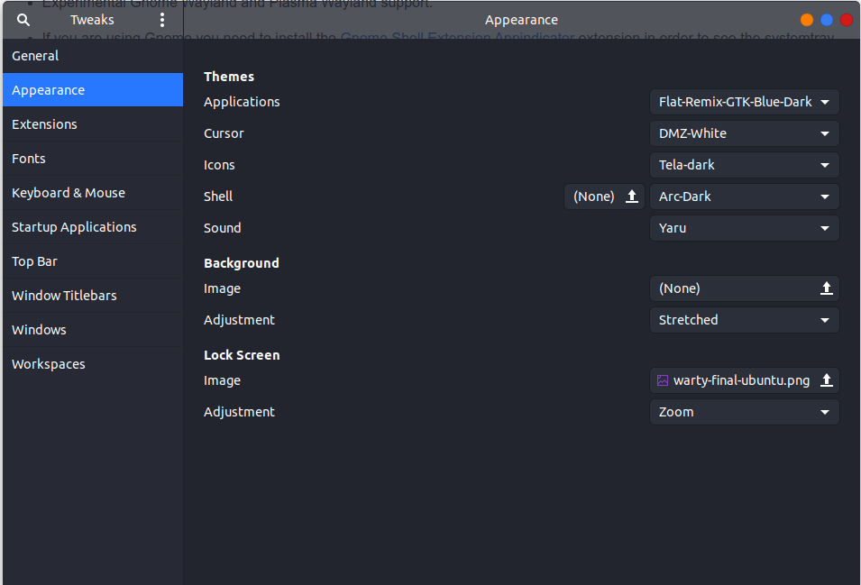
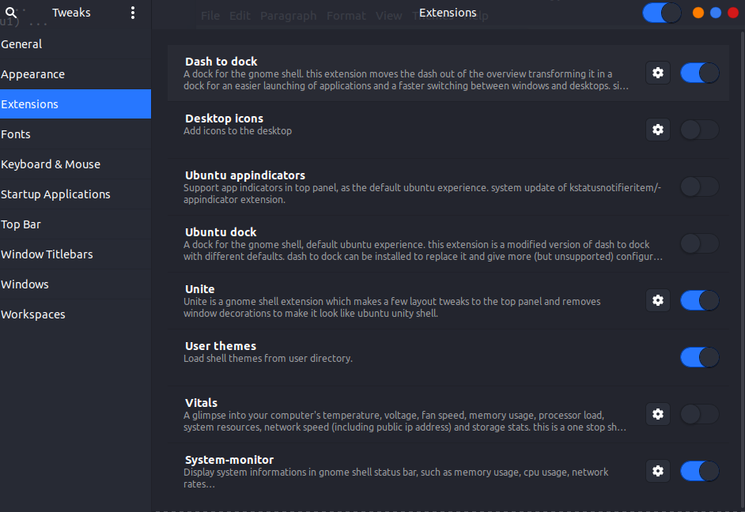

# Ubuntu Utils

```bash
sudo apt-get install snap
sudo apt-get install arc-theme
sudo apt install chrome-gnome-shell
sudo apt-get install gnome-tweaks
sudo apt-get install arc-theme
```

# Install Theme

```bash
cp -R Appearence/Flat-Remix-GTK-Blue-Dark/ ~/.themes/
```


# Icon theme

Go to https://github.com/vinceliuice/Tela-icon-theme

# Gnome Tweaks

## Apperance



## Extensions



# Install Gnome Extensions

- [Chrome Extension](https://chrome.google.com/webstore/detail/gnome-shell-integration/gphhapmejobijbbhgpjhcjognlahblep?hl=pt-BR)
- [Dash to Dock](https://extensions.gnome.org/extension/307/dash-to-dock/)
- [Unite](https://extensions.gnome.org/extension/1287/unite/)
- [User themes](https://extensions.gnome.org/extension/19/user-themes/)
- [System Monitor](https://extensions.gnome.org/extension/120/system-monitor/)

